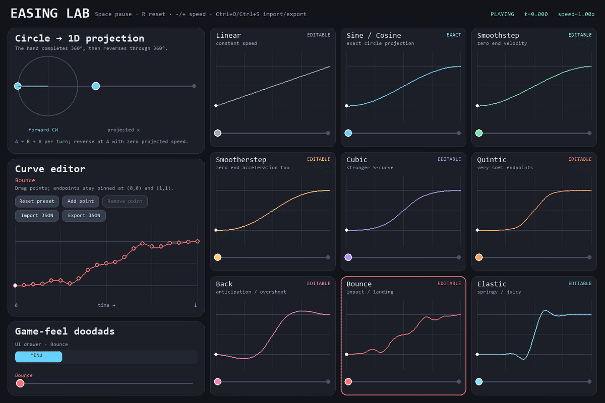

# Easing Lab

[](https://github.com/deviousname/easing-lab/actions/workflows/ci.yml)
[](https://www.python.org/)
[](LICENSE)

Easing Lab is a small Python easing library with a Pygame curve designer for seeing,
shaping, and exporting motion.



*The designer compares nine starting curves and lets you reshape eight of them.*

```bash
pip install pygame-easing-lab
```

Easing Lab is not on PyPI yet. That is the planned install command after the first release;
until then, use the [development setup](#development) below.

Here is a complete animation using only the standard library and Easing Lab:

```text
import turtle
from easing_lab import interpolate, ping_pong
dot = turtle.Turtle("circle")
dot.penup()
def animate(frame=0):
    dot.setx(interpolate(-200, 200, ping_pong(frame / 60), "sine"))
    turtle.ontimer(lambda: animate(frame + 1), 16)
animate()
turtle.done()
```

Easing remaps time: instead of moving at one constant speed, an object can start gently,
land with weight, overshoot, bounce, or settle like a spring.

## Launch the designer

Install the optional Pygame app and run it:

```bash
pip install "pygame-easing-lab[app]"
easing-lab
```

`python -m easing_lab` opens the same designer. Use `easing-lab --help` for window size,
startup file, screenshot, and version options.

## The nine designer curves

The app keeps a focused 3×3 set of starting points. The library also provides separate In,
Out, and In-Out variants for the Sine, Cubic, Quint, Back, Bounce, and Elastic families.

| Curve | Feel |
| --- | --- |
| Linear | Constant speed |
| Sine / Cosine | Smooth circular projection; kept exact and locked |
| Smoothstep | Arrives and leaves at rest |
| Smootherstep | Softer endpoint acceleration |
| Cubic | A stronger S-curve |
| Quintic | Very soft endpoints |
| Back | Anticipation and overshoot |
| Bounce | Impact and landing |
| Elastic | Spring and settle |

### Controls

| Action | Mouse / keyboard |
| --- | --- |
| Select a curve | Click its card |
| Move a control point | Drag it in the editor |
| Add a point | Click **Add point**, then click the graph |
| Remove an internal point | Right-click it, press Delete, or use **Remove point** |
| Reset the selected curve | **Reset preset** |
| Import / export JSON | Buttons or Ctrl+O / Ctrl+S |
| Pause / reset time | Space / R |
| Change speed | `-` / `+`, or `1` / `2` / `3` for 0.5× / 1× / 2× |
| Quit | Escape or close the window |

Select an editable card before importing a custom curve. The import replaces only that
card's working curve.

## Use the library

The math library does not import Pygame or open a window. Inputs are normalized to `0..1`,
and `evaluate` and `interpolate` clamp that input range by default.

### Evaluate and interpolate

```python
from easing_lab import evaluate, interpolate

progress = evaluate("ease_out_cubic", 0.35)
x = interpolate(40.0, 600.0, 0.35, "back")
```

Back and Elastic curves can move outside the start/end range by design. Pass
`clamp_input=False` when you also want to evaluate time outside `0..1`.

The stable family-first keys are:

- `linear`, `smoothstep`, and `smootherstep`
- `sine_in`, `sine_out`, and `sine_in_out`
- `cubic_in`, `cubic_out`, and `cubic_in_out`
- `quint_in`, `quint_out`, and `quint_in_out`
- `back_in`, `back_out`, and `back_in_out`
- `bounce_in`, `bounce_out`, and `bounce_in_out`
- `elastic_in`, `elastic_out`, and `elastic_in_out`

The names used by [easings.net](https://easings.net/) are available in Python form too:
`ease_in_sine`, `ease_out_cubic`, `ease_in_out_back`, and the matching names for every
listed family. Short names such as `sine`, `cubic`, `quintic`, `back`, `bounce`, and
`elastic` select the In-Out version. `EASINGS` exposes the full built-in registry.

### Use vectors or your own value type

```python
import pygame
from easing_lab import interpolate

start = pygame.Vector2(80, 240)
end = pygame.Vector2(720, 240)
position = interpolate(start, end, 0.4, "elastic_out")
```

`interpolate` works with any value type that supports subtraction, multiplication by a
float, and addition. Pygame's `Vector2` follows that small protocol, but Pygame is not
required for floats or other compatible types.

### Load a curve from the designer

```python
from easing_lab import load_easing

ease = load_easing("my_jump.json")
height = ease(0.45)
```

See [the versioned JSON format](docs/curve-format.md) and
[the complete Pygame example](examples/pygame_motion.py).

## Limitations

- The visual designer needs Pygame and a desktop supported by SDL; the math library does not.
- JSON format version 1 stores named built-ins or piecewise cubic Hermite curves. It is not a
  general animation timeline or keyframe format.
- CI covers Windows and Linux on Python 3.10 and 3.13. macOS is not part of the current
  automated matrix.

## Development

```bash
git clone https://github.com/deviousname/easing-lab.git
cd easing-lab
python -m venv .venv
python -m pip install -e ".[dev]"
ruff format --check .
ruff check .
pytest
python -m build
```

The GIF can be reproduced with `python tools/render_readme_gif.py`. Read
[CONTRIBUTING.md](CONTRIBUTING.md) before opening a pull request. Exact test conditions,
artifact checks, dependency boundaries, and provenance are recorded in
[docs/verification.md](docs/verification.md).

## Credits and license

The Back, Bounce, and Elastic families descend from
[Robert Penner's easing equations](https://robertpenner.com/easing/). The curve names and
visual comparisons follow the conventions collected by [easings.net](https://easings.net/).

Easing Lab's source is available under the [MIT License](LICENSE). Pygame is an optional,
separately licensed dependency used by the designer and Pygame example.
