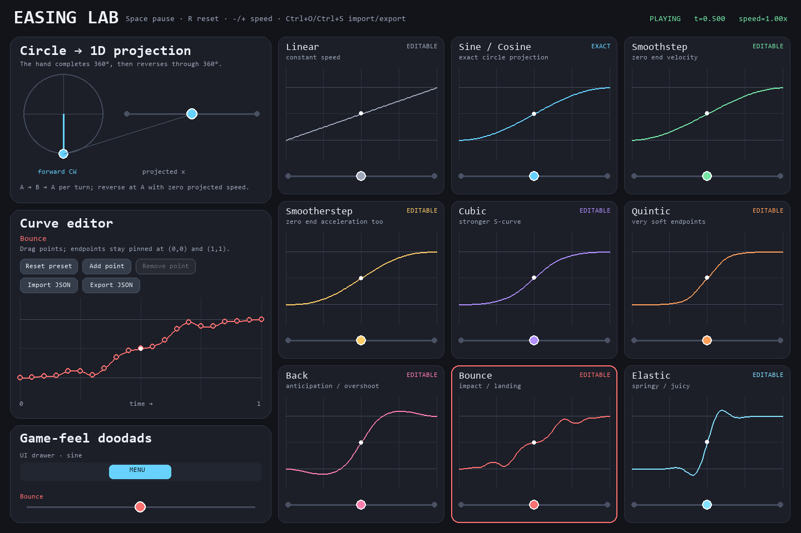

# Easing Lab

[](https://github.com/deviousname/easing-lab/actions/workflows/ci.yml)
[](https://www.python.org/)
[](LICENSE)

An interactive Pygame easing playground and a small, side-effect-free Python library.
Compare motion curves, reshape them by dragging control points, export portable JSON, or
call the same easings directly from a game.



> Evidence labels used below: **Observed** means exercised in this repository under the
> stated conditions; **Derived** means based on the linked public source or standard
> mathematics; **Inferred** means expected but not yet verified in that environment.

## What you can do

- **Observed:** Run a standalone resizable designer with nine built-in easing presets.
- **Observed:** Edit control points, reset a preset, and import or export versioned JSON.
- **Observed:** Use easing functions without opening a window or initializing Pygame.
- **Observed:** Interpolate floats and `pygame.Vector2` values with the same API.
- **Derived:** The locked Sine / Cosine curve is the normalized x-projection of uniform
  circular motion: `(1 - cos(pi*t)) / 2`.

This repository is currently a GitHub review candidate and is not published on PyPI.

## Run the designer

Python 3.10–3.13 is supported by this release candidate.

```bash
git clone https://github.com/deviousname/easing-lab.git
cd easing-lab
python -m venv .venv
```

Activate the environment:

```powershell
# Windows PowerShell
.venv\Scripts\Activate.ps1
```

```bash
# macOS or Linux
source .venv/bin/activate
```

Then install and run:

```bash
python -m pip install -e .
easing-lab
```

`python -m easing_lab` launches the same designer. Use `easing-lab --help` for window,
startup-file, screenshot, and version options.

### Controls

| Action | Mouse / keyboard |
| --- | --- |
| Select a curve | Click its card |
| Move a control point | Drag it in the editor |
| Add a point | Click **Add point**, then click the graph |
| Remove an internal point | Right-click it, press Delete, or use **Remove point** |
| Reset the selected curve | **Reset preset** |
| Import / export JSON | Buttons or Ctrl+O / Ctrl+S |
| Pause / reset time | Space / R |
| Change speed | `-` / `+`, or `1` / `2` / `3` for 0.5× / 1× / 2× |
| Quit | Escape or close the window |

The Sine / Cosine preset stays exact and locked. Select any editable card before importing
a custom Hermite curve; the import replaces only that card's working curve.

## Use it as a library

Imports are intentionally quiet: no Pygame window, display, font, or audio initialization
happens until the designer is launched.

### Interpolate a value

```python
from easing_lab import interpolate

x = interpolate(40.0, 600.0, t=0.35, easing="sine_in_out")
```

Inputs to `interpolate` are clamped to `0..1` by default. Overshooting easings such as
`back` and `elastic` can still move outside the start/end range.

### Move a Pygame object

```python
import pygame

from easing_lab import interpolate, ping_pong

start = pygame.Vector2(80, 240)
end = pygame.Vector2(720, 240)
elapsed = 1.4

t = ping_pong(elapsed, leg_seconds=1.2)
position = interpolate(start, end, t, "back")
```

The interpolation protocol is deliberately small: values need subtraction, scalar
multiplication, and addition. Floats and `pygame.Vector2` satisfy it.

### Call a preset directly

```python
from easing_lab import elastic_in_out, evaluate

raw = elastic_in_out(0.4)  # direct formula; expects normalized time
safe = evaluate("elastic", 1.4)  # clamps the input to 1.0 first
```

Available stable keys are:

`linear`, `sine_in_out`, `smoothstep`, `smootherstep`, `cubic_in_out`,
`quint_in_out`, `back_in_out`, `bounce_in_out`, and `elastic_in_out`.

Short aliases such as `sine`, `cubic`, `quintic`, `back`, `bounce`, and `elastic` are also
accepted by `evaluate`, `interpolate`, and `resolve_easing`.

### Load a curve exported by the designer

```python
from easing_lab import load_easing

ease = load_easing("my_jump.json")
height = ease(0.45)
```

The loader validates the format name, version, control-point count, finite values,
normalized time domain, and strict point ordering. It reconstructs coefficients from the
control points rather than trusting duplicated coefficients in the file.

See [the JSON format](docs/curve-format.md) and
[a complete Pygame motion example](examples/pygame_motion.py).

## Design notes

- **Observed:** The original proof of concept initialized Pygame and entered its event loop
  during import. The release package moves all lifecycle work into `EasingLabApp` and
  guarantees cleanup with `pygame.quit()`.
- **Observed:** The original two-point Linear preset used zero Hermite endpoint slopes and
  therefore evaluated as smoothstep. Two-point curves now use their chord slope; a
  regression test fixes the expected quarter-point value at `0.25`.
- **Observed:** Three-or-more-point custom curves retain zero endpoint slopes and centered
  internal slopes, preserving the editor's arrive/leave-at-rest behavior.
- **Derived:** Pygame's public guidance recommends `pygame.quit()` on exit; the app owns that
  cleanup explicitly. See the [Pygame FAQ](https://www.pygame.org/wiki/FrequentlyAskedQuestions).

## Development

```bash
python -m pip install -e ".[dev]"
ruff format --check .
ruff check .
pytest
python -m build
```

The headless test suite launches the real module entry point, renders a PNG through SDL's
dummy video driver, and checks that the artifact is a non-empty PNG. CI is configured to
run the lint, test, and build gates on Windows and Linux with Python 3.10 and 3.13.

Read [CONTRIBUTING.md](CONTRIBUTING.md) before opening a pull request.

## Compatibility and provenance

- **Observed (Windows 11, Python 3.13.14, Pygame 2.6.1):** a clean virtual environment
  installed the project, ran 40 tests, invoked the installed `easing-lab` entry point,
  rendered a 76,076-byte PNG through SDL's dummy driver, and built both wheel and source
  distributions.
- **Observed (release verification):** exact local tool versions and test results are
  recorded in the Git commit handoff; CI results are authoritative for its listed matrix.
- **Inferred:** other SDL-supported desktop environments may work, but are not claimed until
  exercised by CI or a reported live test.
- **Observed:** the repository contains no downloaded art, font, sound, or other media
  assets. The README screenshot is rendered by Easing Lab itself.
- **Observed:** the easing implementation comes from the user-owned proof of concept and was
  reorganized into an original package without proprietary SDKs or decompiled sources.
- **Derived:** Pygame is a separate LGPL-licensed dependency; its package metadata and
  license are available on [PyPI](https://pypi.org/project/pygame/).

Easing Lab's own source is available under the [MIT License](LICENSE).
